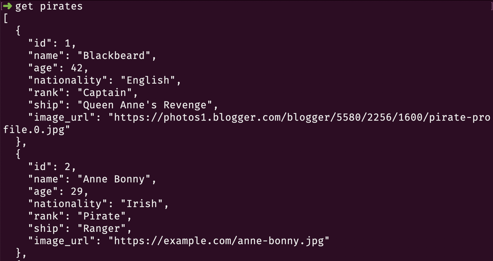
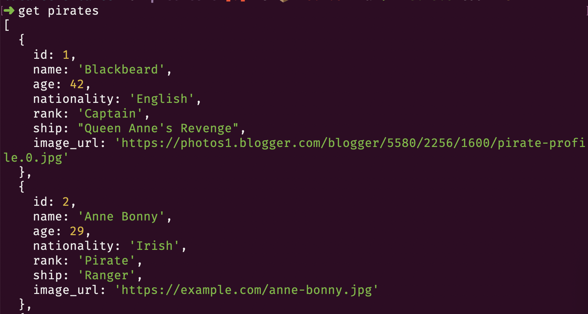

# Workshop One - Shell Aliases and Functions

## Prerequsites

1. Access to an Ubuntu shell
2. Have node and npm installed
3. Have admin access for your user account
4. Have JSON Server installed with `npm i -g json-server`

## Overview

* What is a shell environment? Is it the terminal?
* Temporary aliases.
* Shell initialization and permanent aliases for adding and committing with `git`.
* Bash functions and positional arguments to add, commit and push with a single command. A quick commit.
* Variables vs environment variables.
    ```sh
    greeting="Welcome to your terminal"
    me=$(whoami)
    day=$(date +%A)
    echo "$greeting, $me. Today is $day."
    echo ""
    cal
    ```

### Group Project - Terminal REST Client

1. Create a new directory named `rest-server` wherever you like.
1. In that directory, create a file named `database.json`
1. Copy the JSON provided below into that file.
1. Start your simple API with `json-server database.json -p 8080`.
1. Create a bash function named `setapi` that sets the value of the `REMOTE_API` environment variable to the first positional argument, which will be the root URL to your local API.
	```sh
	setapi http://localhost:8080
	```
1. Create 4 bash functions in your shell initialization file named `get`, `post`, `put`, and `delete` that uses `curl` in silent mode to perform those 4 actions with your local API.
	* You will need one positional argument for `get` that is the resource needed.
		```sh
		get pirates
		```
	* You will need one positional argument for `delete` that is the path to the resource you want to delete.
		```sh
		delete pirates/1
		```
	* You will need two positional arguments for `post`. The first is the JSON data string. The second is the target resource.
		```
		post '{"name": "John Drake", "rank": "Buccaneer", "ship": "Blue Night"}' pirate
		```
	* You will need two positional arguments for `put`. The first is the JSON data string. The second is the path to the resource you want to modify.
		```sh
		put '{ "name": "John Drake", "rank": "Buccaneer", "ship": "Blue Midnight" }' pirates/51
		```
	* The URL for all methods will start with the value of the `REMOTE_API` environment variable _(e.g. `$REMOTE_API/$1`)_

### Changing Your Target API

1. Use `setapi` to change your target to `http://giffyapi.nss.team`.
1. Request the `users` resource.
1. Add yourself as a user with a POST request.
1. Change your password with a PUT request.
1. Delete your user with a DELETE request.

### Explorer Challenge

The output you get in the terminal is basic. There is no color coding of the JSON like you might see in more powerful editors like VS Code.



Your challenge is to use the `json` npm package to colorize and format the JSON. You will need to pipe the output from `curl` to `json -i`. Read [How to Use Pipes on Linux](https://www.howtogeek.com/438882/how-to-use-pipes-on-linux/) to learn more.



### API Data

Expand the details below to get your data.

<details>
<summary>JSON Pirates Data</summary>

```json
{
  "pirates": [
    {
      "id": 1,
      "name": "Blackbeard",
      "rank": "Captain",
      "ship": "Queen Anne's Revenge"
    },
    {
      "id": 2,
      "name": "Anne Bonny",
      "rank": "Pirate",
      "ship": "Ranger"
    },
    {
      "id": 3,
      "name": "Calico Jack",
      "rank": "Captain",
      "ship": "The Revenge"
    },
    {
      "id": 4,
      "name": "Captain Kidd",
      "rank": "Captain",
      "ship": "Adventure Galley"
    },
    {
      "id": 5,
      "name": "Charles Vane",
      "rank": "Captain",
      "ship": "Ranger"
    },
    {
      "id": 6,
      "name": "Edward England",
      "rank": "Captain",
      "ship": "Pearl"
    },
    {
      "id": 7,
      "name": "Edward Teach",
      "rank": "Captain",
      "ship": "Queen Anne's Revenge"
    },
    {
      "id": 8,
      "name": "Henry Avery",
      "rank": "Captain",
      "ship": "Fancy"
    },
    {
      "id": 9,
      "name": "Henry Morgan",
      "rank": "Captain",
      "ship": "Satisfaction"
    },
    {
      "id": 10,
      "name": "Jack Rackham",
      "rank": "Captain",
      "ship": "The Revenge"
    },
    {
      "id": 50,
      "name": "Mary Read",
      "rank": "Pirate",
      "ship": "Ranger"
    }
  ],
  "stories": [
    {
      "id": 2,
      "pirateId": 8,
      "title": "The Ghost Ship",
      "content": "The crew of the merchant ship Mary Celeste were found mysteriously missing, leaving the ship and its valuable cargo untouched. It's been said that the ship still sails the seas, haunting those who cross its path.",
      "date": "1718-09-01"
    },
    {
      "id": 3,
      "pirateId": 3,
      "title": "The Kraken",
      "content": "The Kraken, a massive sea monster, has been the subject of many pirate tales. Its tentacles can stretch for miles and it can easily capsize even the largest ships. Many pirates have met their end at the hands of this fearsome creature.",
      "date": "1718-11-22"
    },
    {
      "id": 149,
      "pirateId": 50,
      "title": "The Curse of the Flying Dutchman",
      "content": "Legend had it that the Flying Dutchman was cursed to sail the seas forever, its crew doomed to an eternal existence as undead pirates. But when a group of adventurers stumbled upon the ship one stormy night, they found that the curse was all too real. Now they must find a way to break the curse before it's too late.",
      "date": "1722-10-15"
    },
    {
      "id": 56,
      "title": "The Battle of Blackbeard's Bay",
      "content": "It was a fierce battle that raged on for hours. The sound of cannons and the clash of swords echoed across the bay. The pirates fought with all their might, determined to come out on top. In the end, it was Blackbeard's crew that emerged victorious, with a chest full of treasure to show for it.",
      "pirateId": 2,
      "date": "1718-09-01"
    },
    {
      "id": 57,
      "title": "The Curse of the Kraken",
      "content": "Legend had it that the Kraken would rise from the depths of the ocean to claim any ship that sailed too close to its lair. The crew of the Black Pearl had heard the tales, but they didn't believe them. That was until they saw the monstrous creature rise from the waves, its tentacles reaching out to grab them. They fought with all their might, but in the end, only a few managed to escape with their lives.",
      "pirateId": 5,
      "date": "1718-09-01"
    },
    {
      "id": 58,
      "title": "The Treasure of Captain Kidd",
      "content": "Captain Kidd had buried his treasure on a deserted island, but he had left behind a map that would lead to its location. Many pirates had tried to find the treasure, but none had succeeded. That was until Captain Jack Sparrow got his hands on the map. He and his crew set sail for the island, and after days of searching, they finally found the treasure. It was more gold than they could ever have imagined.",
      "pirateId": 3,
      "date": "1725-05-30"
    },
    {
      "id": 59,
      "title": "The Betrayal of Black Bart",
      "content": "Black Bart was known as one of the fiercest pirates on the high seas. His crew was loyal to him, and they would follow him to the ends of the earth. Or so he thought. One night, while they were anchored off the coast of Jamaica, his first mate led a mutiny against him. Bart fought bravely, but in the end, he was overpowered. He was left marooned on a deserted island, while his crew sailed off with all his treasure.",
      "pirateId": 4,
      "date": "1722-06-22"
    },
    {
      "id": 60,
      "title": "The Revenge of Calico Jack",
      "content": "Calico Jack had been captured by the British Navy and sentenced to hang. But he managed to escape and vowed revenge against the captain who had betrayed him. He spent months planning his revenge, gathering a crew of loyal men and plotting his attack. Finally, the day arrived, and he and his crew stormed the captain's ship. They fought fiercely, but in the end, it was Calico Jack who emerged victorious. He sailed off into the sunset, a hero to his crew and a thorn in the side of the British Navy.",
      "pirateId": 9,
      "date": "1742-08-15"
    }
  ]
}
```
</details>


